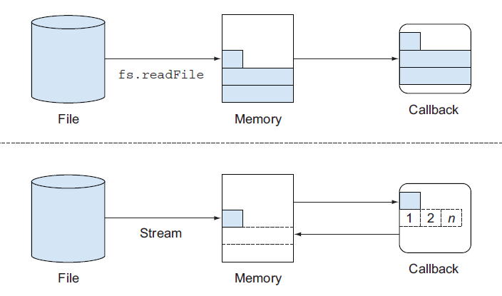

TODO: How to use streams with typescript also
TODO: and also read more about garbage collection on node [MarkSweep, Scavenge]

## Table of contents

0. [Prerequisites](#prerequisites)
1. [Introduction](#intro_to_streams)
2. [Streams Types](#stream-types)
    1. [Readable](#readable-stream)
    2. [Writable](#writable-streams)
    3. [Duplex](#duplex-stream)
    4. [Transform](#transform-stream)
3. [Practical Application](#practical-application)
4. [Resources and conclusion](#resources)

## Prerequisites <a name="prerequisites"></a>

In This article, I am going to show you how to effiecently use streams on your upcoming backend project, and how streams will help you handle streaming data without any bottlnecks.
We'll start by an introduction to stream and it's types then build upon those knowledge a practical video streaming application which accept uploading and streaming videos.

so before going any further, you should have good amound of understanding the following concepts

*File System (fs)*
*Events*
*Buffers*
*Asyncrounsity in js*

## Introduction To Streams <a name="intro_to_streams"></a>

Streams is an abstract interface for creating **data flows betweeen objects**, and can be composed like LEGO-like modularity (composed together)
Streams are not just for working with big data!, one of it's most important features is `composability`, we can compose streams together just like composing linux command line together 'piping'

Strems are event-based API for managing and modeling data, it allows data to be dynamically processed when it's available, then release it when it's no longer available.

On streams: we are not loading the entire file before sending it, we're sending it bit by bit as the server process it or recieve it  


### Stream Base Classes

Those are the stream base classes `Readable`, `Writable`, `Duplex`, `Transform`, `PassThrough` which we will use pretty heavily and I am going to discuss each one in details

Example of Stream implementations are very common:
**Who uses Streams?**

| Readable Streams | Writable Streams |
| --- | --- |
| HTTP response, on the client | HTTP requests, on the client |
| HTTP requests, on the server | HTTP responses, on the server |
| fs read streams | fs write streams |
| zlib streams | zlib streams |
| crypto streams | crypto streams |
| TCP sockets | TCP sockets |
| child process stdout & stderr | child process stdin |
| process.stdin | process.stdout, process.stderr |

- HTTP: both `req` and `res` are Streams
- Parser: most parsers are implemented using streams, e.g `json`, `xml` `csv` parser
- Audio
- RPC (Remote procedure call): sending stream over network is a useful way to implement interprocess communication
- And many more

### Examples

To know the importance of stream over data, let's see first how data will be processed without them?
;

**The Buffer example**
The thing you need to know about `fs.readFile`, is it loads all the content into memory, which will make your node server run out of memory in case you are going to scale.

```js
import http from 'http'
const file = './sample.mp4';
const server = http.createServer((req, res) => {
    fs.readFile(file, (err, data) => {
        res.writeHeader(200, {'Content-Type': 'video/mp4'});
        res.end(data);
    })
}).listen(3000, () => console.log("port 3000 is running!));
```

run

```bash
node --trace_gc buffer.js
```

`--trace_gc` allows you to trace **garbage collection** on node process

Now open up your browser and open the server from 5 different tabs and notice the memory consumption from your task manager or process manager!

On the terminal you'll see that there're alot of `Mark-sweep` and `Scavenge`
`Mark-sweep` is going to stop node process to clean alot of garbage
the `Scavenge` does not clean so much garbage, so they won't do so much harm or affect the process as the `Mark-sweep`!
you can read more about garbage collection algorithms online if you're curious to know more!

**the Stream exmaple**
In the previous example we could use `fs.read` and with suitable buffer and specifiying length, we can read certain amound of buffer at a time, but this approach involve more complexity, so `fs` provide us with simple stream API to abstract this complexity
the stream will read the file bit by bit and send those bits to the client as soon as they arrive, so we've reduced the memory consumption!

```js
http.createServer((req, res) => {
    fs.createReadStream(file).pipe(res).on('error', console.error);
}).listen(3000, () => console.log("port 3000 is running!"));
```

repeat the process I told you before and you'll notice that the `Mark-sweep` is less than this time from the buffer example, and memory consumption is nearly noticable

On this technique, there's also a huge benefit, consider that the client has slower connection, in this case, the network stream will signal this by requesting that the I/O source pauses until the client it ready for more data, this is known as `backpressure`

Another huge benefit is we consider we are sending large files, we need to cut the size down to reduce network headahce, we could compress the data and then sent

```js
const { createServer } = require("http");
const { createReadStream } = require("fs");
const zlib = require("zlib");
createServer((req, res) => {
  res.writeHead(200, { "Content-Encoding": "gzip" });
  createReadStream(__dirname + "/index.html")
    .pipe(zlib.createGzip())
    .pipe(res);
}).listen(3000, () => console.log("port 3000"));
```

:small_red_triangle: Notice this example is just to illustrate how streams work, this example is not suitable for HTTP production asset server

**Another Example**
This example will demonstrate the power of streams
first we need to generate a big file

```js
const {createWriteStream} = require("fs");
const writerFile = createWriteStream("./big.file");

for (let i = 0; i <= 1e6; i++) {
  writerFile.write(
    "Lorem ipsum dolor sit amet, consectetur adipisicing elit, sed do eiusmod tempor incididunt ut labore et dolore magna aliqua. Ut enim ad minim veniam, quis nostrud exercitation ullamco laboris nisi ut aliquip ex ea commodo consequat. Duis aute irure dolor in reprehenderit in voluptate velit esse cillum dolore eu fugiat nulla pariatur. Excepteur sint occaecat cupidatat non proident, sunt in culpa qui officia deserunt mollit anim id est laborum.\n"
  );
}

file.end();
```

Running this script above results on a file size of nearly *~400 MB*
We need now to server this file from a server

```js
const fs = require("fs");
const server = require("http").createServer();

server.on("request", (req, res) => {
  fs.readFile("./big.file", (err, data) => {
    if (err) throw err;

    res.end(data);
  });
});

server.listen(8000);
```

Even though we're not blocking the event loop, but this doesn't mean we're consuming memory!, if you open up your process manager, you'll see that memory rises by nearly *~ 500 MB*, this means `fs.readFile` load all the file content into memory and this is very ineffiecient

to work around this problem, `res` is writableStream, so we can actually use a reading Stream and pipe this to `res`

```js
const fs = require("fs");
const server = require("http").createServer();

server.on("request", (req, res) => {
  *const src = fs.createReadStream("./big.file");
  src.pipe(res);*
});

server.listen(8000);
```

Now look at your process manager and notice the memory consumption! (Magnfiencet isn't it?!)

## Stream Types <a href="stream-types"></a>

There are four main types of streams in Node:

- Readable : represents The source, ex `req`
  
- Writable: The Destination, `res`
  
- Duplex: A kind Middleware that can do both, TCP socket
  
- Transform: Manipulator!, aka "through streams", `zlib.createGzip`
  
Streams are instances of `EventEmitter`, They inherit from the EventEmitter Base Class so, they emit events such as "error", "data", and so on!
Streams are not limited to just using streams, it also can use `piping` which we'll discuss on a moment!

Streams have two main approach:

1. event mode
  This event mode uses `raising events` to handle incoming data, error-handling, finish receiving data and so on
  
  ```js
  readStream.on("data", (chunk) => {
  // Do something with that chunk!
  }) 
  readStream.on("end", () => {
  console.log("finished reading this file!");
  })
  ```
  
2. piping mode
  Just like linux cli piping command `|`
  
  ```bash
  @meska:~  cat file.txt | wc -l 
  ```
  
  On Node we've something similar
  
  ```js
  readableSrc.pipe(writableSrc);
  ```
  
Piping is the easiest way to work with streams, as it takes care of:

- handling-errors
- handling end of files
- hanlding `backpressure` (we're going to discuss later!)

Also with piping we can do a pipeline (chain of pipes) if we're using Duplex Streams
  a -> Readable
  b,c -> Duplex
  d -> Writable
  
  ```js
  a.pipe(b)
  .pipe(c)
  .pipe(d);
  ```
  
  which is equivalent to
  
  ```js
  a.pipe(b);
  b.pipe(c);
  c.pipe(d);
  ```
  
Now Let's discuss each type in details

### Readable <a name="readable-stream"></a>
  
Readable can read from any type of source ['audio', 'video', 'images', 'text', 'binary file', etc], it provide flexible API around I/O sources
example of Readable Stream are : [http request on the server, http response on the client, file system, ziping/unziping, tcp process, std.in];
*Methods and Events Of Readable Stream*

1. events

- The `data` event, which is emitted whenever the stream passes a chunk of data to the consumer
  
- The `end` event, which is emitted when there is no more data to be consumed from the stream.
  
2. methods

- `pipe`/`unpipe`
- `read`/`unshift`/`resume`

Readable Stream has two main modes which controls the way we consume it:

1. `flowing mode`
2. `pausing mode`
those modes are referred to sometimes *pull* and *push*
 To manually switch between those two modes, we use`resume()` and `pause()` methods
*note:*
Pipe method handles modes automatically!

```js
const { Readable } = require("stream");
const inStream = new Readable({});

inStream.push("ABCDEGEEGGG");
inStream.push("NOPQRSTUFGF");

inStream.push(null);

inStream.pipe(process.stdout);
```

In this example, we are pushing all the data into the stream
& piping it to a `process.stdout`
What if we need to push data on demand, when the consumer asks for it?

```js
const { Readable } = require("stream");
const inStream = new Readable({
  read(size) {
    this.push(String.fromCharCode([this.currentCharCode++]));
    if (this.currentCharCode > 90) {
      this.push(null);
    }
  },
});
inStream.currentCharCode = 65;
inStream.pipe(process.stdout);
```

We can implement our instance of Readable Stream
we've two main ways of implementing our custom stream

1. using `class` approach
2. using `constructor` approach

**using Classes**

```js
const { Readable } = require("stream"); // Readable interface

const arr = [
  "aaa",
  "bbbbbbbbbbbb",
  "cccccccccccccccc",
  "dddddddddddddddddddddd",
  "yyyyyyyyyyyyyyyyyyyyyyyyyyy",
];

const arrStream = new StreamFromArray(arr);

class StreamFromArray extends Stream {
  constructor(array) {
    super({encoding: "utf-8"});
    this.array = array;
    this.index = 0;
  }
  _read() {
    if (this.index <= this.array.length) {
      const chunk = this.array[this.index];
      this.push(chunk);
      this.index += 1;
    } else {
      this.push(null);
    }
  }
}
arrStream.on("data", (chunk) => console.log(chunk));
arrStream.on("end", () => console.log("done!"));
```

Each Stream has internal methods which we can overwrite:
_read() for readable Stream
and_write() for writable Stream
_read() and_write() for duplex Stream and there are more internal methods we can overwrite!

`this.push` -> pushed to the stream (arrStream) so we trigger the "data" event
`this.push(null)` -> this signals "end" event

By Default the encoding is `Buffer` and you can specifiy otherwise throught an options passing to the super()
and you can use `objectMode` which you can pass to the stream list of objects

super can accept {objectMode: true} which make the stream read any type of objects

```js
const chunk = {
    data: this.array[this.index],
    index: this.index
}
```

Some Streams are on flowing mode: meaning they automatically push incoming data to the Stream
non-flowing mode is asking for data! process.stdin is an example
we can switch betweeen flowing mode and non-flowing mode if we want to, look for this example

```js
readStream.pause(); 
process.stdin.on("data", (chunk) => {
    readStream.read();
})
```

you will begin to notice, node waits for you to enter
but for this kind of implementation, the readStream after finishing reading all the chunks, is still on the non-flowing mode
we need to convert it back to flowing mode when he finishes reading
`resume` -> turn the stream into flowing mode
`pause` -> turn the stream into pause mode

```js
readStream.pause(); 
process.stdin.on("data", (chunk) => {
    if(chunk.toString().trim() === 'finish'){
        readStream.resume();
    }
    readStream.read();
})
```

type finish and you will notice that the readStream start pushing the chunks automatically

### Writable Streams <a name="writable-stream"></a>

They represent a destination for incoming data!
for example, process.stdout and stderr

```js
const { createReadStream, createWriteStream } = require("fs");

const src = createReadStream("./sample.mp4");
const dest = createWriteStream("./copy.mp4");

src.on("data", (chunk) => {
  console.log(`chunks: ${chunk.length}`);
  dest.write(chunk);
});

src.on("end", () => {
  dest.end();
});

dest.on("close", () => {
  process.stdout.write("file copiled\n");
});
```

**Using Constructor**
using this approach we are creating an object from the `Writable` constructor and passing this constructor a few options

```js
const {Writable} = require('stream');
const writeStream = new Writable({
  write(chunk, encoding, callback){
    console.log(chunk.toString());
    callback();
  }
})
process.stdin.pipe(writeStream);
```

- callback() is used for signaling failure or success of writing chunks
- chunk: a buffer of data, unless we specifiy otherwise
- encoding: we can ignore encoding options

the code above is just equivalent to

```js
process.stdin.pipe(process.stdout);
```

#### BackPressure


setting `highWaterMark`


Sometimes the incoming data is too fast for writable stream to handle

- `Backpressure` -> our hose
- `highWaterMark` -> how much our hose can handle

`.write()` returns a boolean value representing if there's Backpressure or not

```js
const {createReadStream, createWriteStream } = require('fs');
const readStream = createReadStream('./sample.mp4');
const writeStream = createWriteStream('./copy.mp4');

readStream.on('data', (chunk) => {
    const result = writeStream.write(chunk);
    if(!result){
        console.log('backpressure');
        readStream.pause();
    }
})
writeStream.on('drain', () => {
    console.log('drained');
    readStream.resume();
})
writeStream.on('close', () => {
       console.log("file copied")
})
```

we'll listen for `drain` event to know that writeStream is drained so we continue writing reading and writing again!

- The `drain` event, which is a signal that the writable stream can receive more data.

setting `hightWaterMark` gives internal buffer of writeStream enough space to handle all the video

```js
const writeStream = createWriteStream('./copy.mp4', {
    highWaterMark: 16985
});
```

### Piping Streams

readableSrc => writableSrc

Your application logic will get complicated when involving more and more event handling, so the idea of using events could be reduced a little by piping!

we can do a Streaming pipeline

```js
a.pipe(b)
  .pipe(c)
  .pipe(d);

// Which is equivalent to:
a.pipe(b);
b.pipe(c);
c.pipe(d);
readableSrc
  .pipe(transformStream1)
  .pipe(transformStream2)
  .pipe(finalWrtitableDest);
```

`pipe` returns the destination stream, and handle errros, backpressure for us also!

```js
readStream.pipe(writeStream).on("error", (error) => console.log(error))
```

we could pipe any readableStream to any writableStream

```js
process.stdin.pipe(writeFileStream);
```

### Duplex Stream

Duplex stream implements both read and write stream, you can think of Duplex Stream as a middle tier between readable and writable stream,

Duplex streams don't change anything about the data!

Duplex Streams help us compose streams to pipelines

- PassThrough
  
- Transform
  
Duplex Streams can be piped between readable and writable

```js
const {PassThrough} = require('stream');
const {createReadStream, createWriteStream} = require('fs');
const readStream = createReadStream('./sample.mp4');
const writeStream = createWriteStream('./sample-copy.mp4');
const middle = new PassThrough();
readStream.pipe(middle).pipe(writeStream)
```

I think the most important thing about duplex stream is giving us the ability to hook it as middleware between two streams and manipulate the date coming in and coming out!

In the demo below we are using a throttle to delay reading the chunk!

```js
const { PassThrough, Duplex } = require("stream");

const { createReadStream, createWriteStream } = require("fs");

const readStream = createReadStream("./sample.mp4");
const writeStream = createWriteStream("./copy4.mp4");
class Throttle extends Duplex {
  constructor(ms) {
    super();
    this.delay = ms;
  }
  _write(chunk, encoding, callback) {
    this.push(chunk);
    setTimeout(callback, this.delay);
  }
  _read() {}
  _final() {
    this.push(null);
  }
}
const report = new PassThrough();
const throttle = new Throttle(10);

readStream.pipe(throttle).pipe(report).pipe(writeStream);
let total = 0;
report.on("data", (chunk) => {
  total += chunk.length;
  console.log("bytes read", total);
});
```

### Transform Stream

transform stream is special kind of duplex stream which can actually 'transform' data between two streams as the name suggests!

let's see a quick demo

```js
const { Transform } = require("stream");

class ReplaceText extends Transform {
  constructor(char) {
    super();
    this.replaceChar = char;
  }
  _transform(chunk, encoding, callback) {
    let transformChunk = chunk.toString().replace(/[a-zA-Z0-9]/gi, "x");
    this.push(transformChunk);
    callback();
  }
  _flush(cb) {
    this.push("more stuff is being passed ...");
    cb();
  }
}
let xStream = new ReplaceText("x");
process.stdin.pipe(xStream).pipe(process.stdout);
```

`_flush` is used to add more data even if the readStream is stopped!

## Real World Example Of Streams

There alot of 3rd party modules that implements streams in it's core functionalites

- Mongoose

- MySQL
  
  ```js
  const query = connection.query("SELECT * FROM posts");
  query.on("result", () => {
  connection.pause(); // stop untill the receiver is ready for more data!
  processRow(row, function() {
    connection.resume();
  })
  })
  ```
  
- Express (Yup!)
  and so many more.
  but on this section, I will try with you to implement Stream into some projects to get the full idea!

## conclusion
  
There are alot of Streams out there, `zlib` package => transform stream that can zip incoming data from read stream and send it to writeStream

`crypto` module rely heavily also on a duplex stream which can encrypt data from readale Stream and send encrypted data to a writable stream and vice versa

Streams are essential part of Node. perhaps the most powerful yet understimated Node concept

### Video Server

`fs.createReadStream()`

Unlike the 16 kb default `highWaterMark` for a `stream.Readable`, the stream returned by this method has a default `highWaterMark` of 64 kb.

`options` can include `start` and `end` values to read a range of bytes from the file instead of the entire file. Both `start` and `end` are inclusive and start counting at 0, allowed values are in the [0, `Number.MAX_SAFE_INTEGER`] range. If `fd` is specified and `start` is omitted or `undefined`, `fs.createReadStream()` reads sequentially from the current file position. The `encoding` can be any one of those accepted by `Buffer`

```js
const { createServer } = require("http");
const { promisify } = require("util");
const { stat, createReadStream, createWriteStream } = require("fs");
const fileInfo = promisify(stat);
const filename = "../sample.mp4";
const multiparty = require("multiparty");
const respondWithVideo = async (req, res) => {
  const { size } = await fileInfo(filename);
  const { range } = req.headers;
  if (range) {
    let [start, end] = range.replace(/bytes=/, "").split("-");
    start = parseInt(start, 10);
    end = end ? parseInt(end, 10) : size - 1;
    console.log(end);
    console.log(start);
    res.writeHead(200, {
      "Content-Type": "video/mp4",
      "Accept-Ranges": `bytes`,
      "Content-Length": end - start + 1,
      "Content-Range": `bytes ${start}-${end}/${size}`,
    });
    createReadStream(filename, { start, end }).pipe(res);
  } else {
    res.writeHead(200, {
      "Content-Type": "video/mp4",
      "Content-Length": size,
    });
    createReadStream(filename).pipe(res);
  }
};
createServer(async (req, res) => {
  if (req.method == "POST") {
    let form = new multiparty.Form();
    form.parse(req);
    // part is readable stream, part is the actually file get sen!
    form.on("part", (part) => {
      part.pipe(createWriteStream(`./${part.filename}`)).on("close", () => {
        res.writeHead(200, { "Content-Type": "text/html" });
        res.end(`<h1>file Uploaded:${part.filename}</h1>`);
      });
    });
    // req.pipe(res);
    // req.pipe(process.stdout);
    // req.pipe(createWriteStream("./upload.file"));
  } else if (req.url == "/video") {
    respondWithVideo(req, res);
  } else {
    res.writeHead(200, {
      "Content-Type": "text/html",
    });
    res.end(`<form enctype="multipart/form-data" method="POST" action="/">
                <input type="file" name="upload-file">
                <button type="submit">Upload file</button>
            </form>`);
  }
}).listen(3000, () => {
  console.log("server is up and running on port 3000");
});
```

**Handling range requests**

**Parsing Multi-form data**

the problem with the first approach, is we can handle only textual data, so we're using npm package `multiparty` to help use parse the incoming file as parts!

**Another Project**

you will find it on the playground `video-streaming`

### Some Application and Tips

When choosing database, or network package, choose the one which provide stream API becuase it's likley to be scalable and can handle large amount of data effiecently


1. old
  
  ```js
  const {Readable} = require('stream');
  function MyStream(options){
  Readable.call(this, options);
  }
  MyStream.prototype = new Readable();
  ```
  
  this is considered a bad practice, use ES5 `Object.create()` instead
  
  ```js
  MyStream.prototype = Object.create(Readable.prototype, {
  constructor: {value: MyStream}
  });
  ```
  
2. new
  using classes which is more convienent and easy to use
  
  ```js
  class MyStream extends Readable {
  constructor(options){
   super(options);
  }
  }
  ```
  
  passing options is an important, because stream uses this options to configure the streams
  in case of Readable:
  
- hightWaterMark: number of bytes to be stored in the internal buffer before pausing reading from the data source
- encoding: "utf-8" and "ascii" and so on
- objectMode: allow the stream to behave as stream of objects rather than bytes!

```js
const express = require("express");
const { Readable } = require("stream");
const util = require("util");
const app = express();
class StatStream extends Readable {
  constructor(limit) {
    super();
    this.limit = limit;
  }
  _read(size) {
    if (this.limit === 0) {
      this.push(null);
    } else {
      this.push(util.inspect(process.memoryUsage()));
      this.push("\n");
      this.limit--;
    }
  }
}
app.get("/", (req, res) => {
  let statStream = new StatStream(10);
  statStream.pipe(res);
});
app.listen(3000, () => {
  console.log("port 3000");
});
```

## Resources <a name="resources"></a>

Resources:

1. jsComplete [samer buna]
  
2. Advanced Node - Linkedin Learning
  
3. Node In practice
